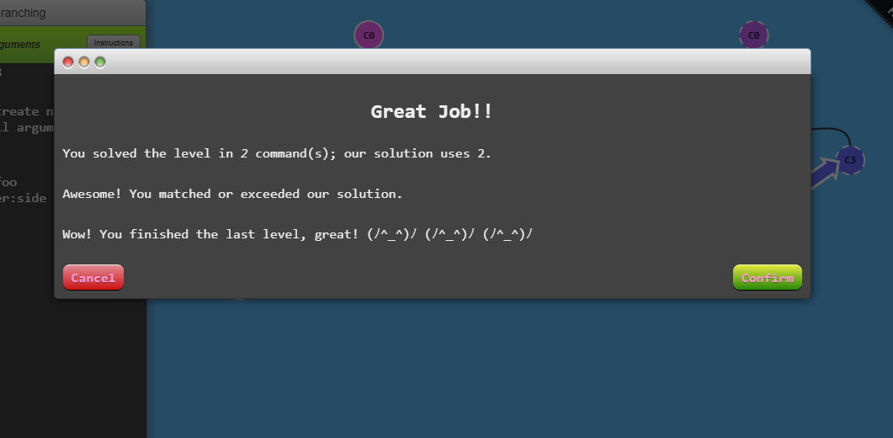
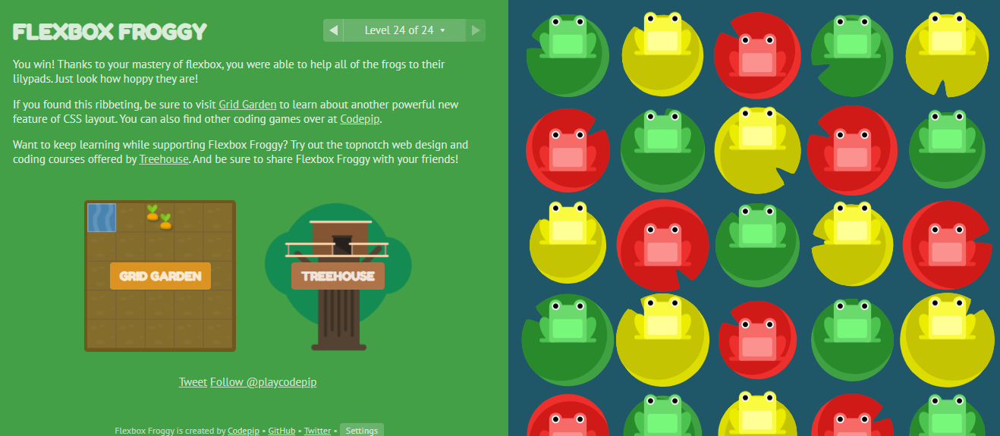
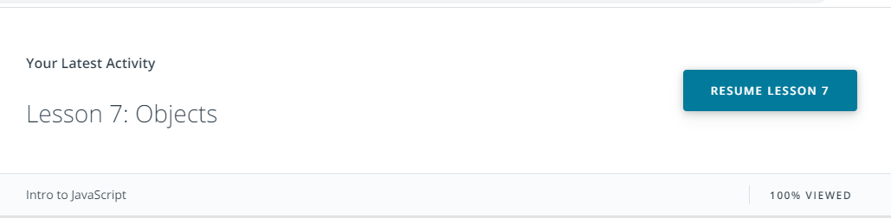
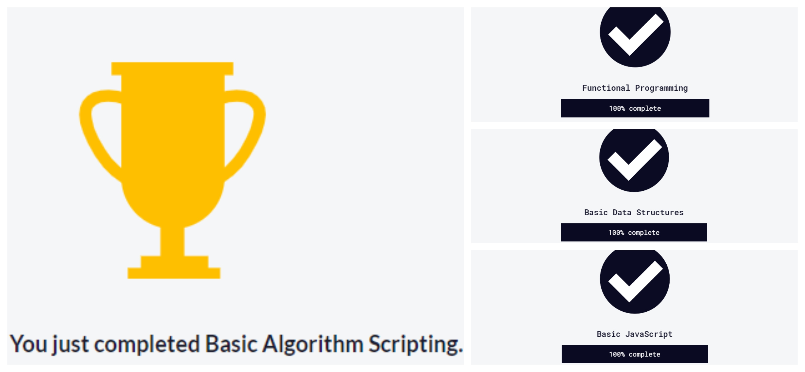
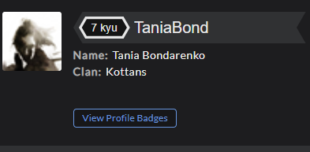

# kottans-frontend

<html>
<body>
  <h2>Tasks Listing</h2>
  

   <h3>1. Git intro</h3>
  

  I'm really exciting about GIT. It was my first time working with it.
Thanks to git bash, I feel myself a real programmer.
The command line conception is interesting and adventuring for me. 
   VCS is super usefull fo developers, it helps to improve their code 
and makes their work much easier and stresless. You can always return
to that piece of code, which is the best in your opinion without 
worriing to loose some code or project. Git also makes collaboration
easier, allowing changes by multiple people to all be merged into one source.  
 
A Git repository (or repo for short) contains all of the project files and the entire revision history.
To record the changes firstly we should add (index) files to a staging (index) area. Then we make a commit,
Commit takes a picture of what files look like at the moment and stores a reference. 

Storing a copy of your Git repo with an online host (such as GitHub or
Bitbucket) gives you a centrally located place where you can upload your changes
and download changes from others, letting you collaborate more easily with other
developers. After you have a remote repository set up, you upload (push) your
files and revision history to it. After someone else makes changes to a remote
repo, you can download (pull) their changes into your local repo.  Pull
requests are a way to discuss changes before merging them into your codebase,
and decide if you want to merge it or not.

 
      <h3>2. Linux CLI, HTTP</h3>
      

<h4>Linux CLI</h4>

This was my first experience with Linux system.
First two modules were quite simple.
I've wondered that the commands are similar with GIT commands.
That's why it was easy to understand and memorize it.  
Due to its single-tree approach, the Linux filesystem structure is much more flexible and usable than the Windows structure. 
 
I'd like to left here information about "grep" command - this is one of the most obscure and easily-forgotten command names in Linux, but it is also one of the most useful. You can use "grep" to find patterns in data. 
 
Picture, showed my result about learning Linux CLI, is <a href ="https://github.com/TaniaBondarenko/kottans-frontend/blob/main/task_linux_cli/linux_surv.png">here</a> 

<h4>HTTP</h4> 

In few words, HTTP allows for communication between a variety of hosts and
clients, and supports a mixture of network configurations. 
To make this possible, it assumes very little about a particular system, and
does not keep state between different message exchanges. This makes HTTP a
stateless protocol. 
Communication between a host and a client occurs, via a request/response pair.
The client initiates an HTTP request message, which is serviced through a HTTP
response message in return. 
There are a few different ways a server can collect this information, and most
websites use a hybrid of these approaches:
<ul>
<li>Request headers: From, Referer, User-Agent</li>
<li> Client-IP - the IP address of the
client </li>
<li>Fat Urls - storing state of the current user by modifying the URL and
redirecting to a different URL on each click; each click essentially accumulates
state.</li>
<li> Cookies - the most popular and non-intrusive approach.</li>
</ul>
 HTTP does support a rudimentary form of authentication called Basic Authentication, as well as the
more secure Digest Authentication. Web server needs a digital certificate to
identify itself. Certificates (or "certs") are issued by a Certificate Authority
(CA) and vouch for your identity on the web. The CAs are the guardians of the
PKI. Caches are used at several places in the network infrastructure, from the
browser to the origin server. Depending on where it is located, a cache can be
categorized as: private and public. Cache Processing Regardless of where a cache
is located, the process of maintaining a cache is quite similar:
<ul>
<li>Receive request message.</li>
<li> Parse the URL and headers.</li>
<li> Lookup a local copy; otherwise, fetch and store locally</li>
<li> Do a freshness check to determine the age of the content in the cache; make a request to refresh the content only if
necessary.</li>
<li> Create the response from the cached body and updated headers.</li>
<li> Send the response back to client.</li>
 <li>Optionally, log the transaction.</li>
 </ul>

      

      <h3>3. Git Collaboration</h3>

Forking a repository creates an identical copy of the original repository and moves this copy to our  account. We have total control over this forked repository. Modifying our forked repository does not alter the original repository in any way.

The <b>git log</b> command is extremely powerful, and we can use it to discover a lot about a repository. But it can be especially helpful to discover information about a repository that we're collaborating on with others. We can use git log to:
<dl>
  <ul>
  <li><dt><b>git shortlog</b></dt>
    <dd>group commits by author with git shortlog</dd></li>
  <li><dt><b>git log --author="last name"</b></dt>
    <dd>filter commits with the --author flag</dd></li>
<li><dt><b>git log --grep="something to search for"</b></dt>
    <dd>filter commits with the --author flag</dd></li>
  </ul>
    </dl>

<b>Pull Requests</b> is sending the original project's maintainer a request to include new code changes. 
Before the start doing any work, check the project's CONTRIBUTING.md file. 

Next, it's a good idea to look at the GitHub issues for the project:

<ul>
<li>look at the existing issues to see if one is similar to the change we want to contribute</li>
<li>if necessary create a new issue</li>
<li>communicate the changes we'd like to make to the project maintainer in the issue</li>
</ul>

To create a pull request, a couple of things need to happen:

<ul>
<li>fork the source repository</li>
<li>clone our fork down to our machine</li>
<li>make some commits (ideally on a topic branch!)</li>
<li>push the commits back to our fork</li>
<li>create a new pull request and choose the branch that has our new commits</li>
</ul>

The <b>git rebase</b> command will move commits to have a new base.

Check my progress on courses <a href="https://github.com/TaniaBondarenko/kottans-frontend/blob/main/task_git_collaboration/finish_git_coll.png" alt ="Picture of finishing GIT_Collaborations">here</a>, <a href="https://github.com/TaniaBondarenko/kottans-frontend/blob/main/task_git_collaboration/main.png" alt="Picture of progress on Main gitbranching">here</a> and <a href="https://github.com/TaniaBondarenko/kottans-frontend/blob/main/task_git_collaboration/remote.png" alt="Picture of progress on Remote gitbranching">here.<a/> 

      <h3>4. Intro to HTML and CSS</h3>
  

I liked that the lessons have a lot of practice in HTML/CSS. 
It was good for my remember the main tags and properties. 
To check, how I've finished lessons <a href="https://github.com/TaniaBondarenko/kottans-frontend/blob/main/task_html_css_intro/intro_html_css.png" alt="Screenshot of completing HTML/CSS intro course">click on link.</a> 
I was amased about interactive courses from codecadamy. Tonns of practice where I could check immediately
how all my actions had been influencing on how the web-page looked like. Very informative and understandable.  
And I loved it. 
Find screenshots of completed courses <a href="https://github.com/TaniaBondarenko/kottans-frontend/blob/main/task_html_css_intro/codecademy_html.png" alt="Screenshot of completing HTML course">HTML</a> and <a href="https://github.com/TaniaBondarenko/kottans-frontend/blob/main/task_html_css_intro/codecademy_css.png" alt="Screenshot of completing CSS course"> CSS.</a>
  

      <h3>5. Responsive Web Design</h3>
      

Information about Responsive design was very useful for me and my latest projects. 
It's really important to fit content, which I'll be creating, to the most type of devices.

Firstly there is nessesery to add code below into header: 

<code>meta name="viewport" content="width=device-width,
initial-scale=1.0"</code>  

I like new information about @media query and patterns. I should definitely learn more about common responsive pattern and how to use it correctly. Most design patterns will use breakpoints to adapt for different screen sizes.  
<b>Common responsive patterns:</b>
<ol>
<li><dt>Column drop</dt>
       <dd>this pattern implements a multi-column layout and ends up with a single column layout, dropping columns along the way as the screen size becomes more narrow.</dd></li>
<li><dt>Mostly fluid</dt>
       <dd>this pattern relies on a fluid grid for big and smaller screens and it adds the margins on wider screens. It usually supposes only one breakpoint. </dd></li>
<li><dt>Layout Shifter</dt>
       <dd>This pattern has multiple breakpoints across several screens making it the most responsive pattern. This also makes greater flexibility.
</dd></li>
<li><dt>Off canvas</dt>
       <dd>this pattern moves content off the screen, only showing it when the screen size is large enough to display it. However, the hidden content is available through pop up menus or hamburger menus to save space.</dd></li>
</ol>

 I've got a usefull information how to handle with tables as responsive. The best ways are to hide some part of columns (hidden columns), make the whole table scrollable (contained scrolling) and display table as non-table content (no more tables). This tips should be vary  depending on table content and its importance.

Game Flexbox Froggy was a bit adventure and gave me a break in a flow of serious and needful information on this course.
 

      <h3>6. JavaScript Basics</h3>
      

     
I had some tiny experience with learning JavaScript. But this part of course was challenging for me.
     I've just left some useful theses for me:

<ul>
<li>Spread Operator. The spread operator takes an array (or any iterable) and spreads it values. <code>arr1=[...arr2] </code>make copy of arr2 and assign it to arr1.
The spread operator allows us to spread the value of an array (or any iterable) across zero or more arguments in a function or elements in an array (or any iterable). The rest parameter allows us to pass an indefinite number of parameters to a function and access them in an array.</li>

<li>Destructuring Assignment. 
Destructuring assignment is special syntax introduced in ES6, for neatly assigning values taken directly from an object. 
Destructuring allows you to assign a new variable name when extracting values. You can do this by putting the new name after a colon when assigning the value. </li>
 </ul>

Two distinct principles for functional programming:
<ol>
<li> Don't alter a variable or object - create new variables and objects and return them if need be from a function.</li>

<li>Declare function arguments - any computation inside a function depends only on the arguments, and not on any global object or variable.</li>
</ol>

 FreeCodeCamp tasks were pretty easy at the first, but then became more complicated and I needed to looking for some extra materials.  

I was recalling methods for arrays, objects and strings. I also learned those, which were new to me.

I believe that I improved my knowledge of JavaScript.

      

      <h3>7. Document Object Model</h3>
      

The DOM stands for "Document Object Model" and is a tree-like structure that is a representation of the HTML document, the relationship between elements, and contains the content and properties of the elements. 
The DOM is not:
  <ul>
 <li>part of the JavaScript language.</li>
</ul>
The DOM is:
<ul>
<li>constructed from the browser</li>
<li>is globally accessible by JavaScript code using the document object:</li>
<ul>
<li>characters</li>
<li>tags</li>
<li>tokens</li>
<li>nodes</li>
<li>DOM</li>
</ul>
</ul>

The DOM is an object-oriented representation of the web page, which can be modified with a scripting language such as JavaScript.

I knew nothing about DOM. It was interesting to learn it. I found it very useful and logic.

<a href="https://github.com/TaniaBondarenko/kottans-frontend/tree/main/task_js_dom" alt="Screenshots for finishing learn">Here</a> is my screenshots from learning. 
And <a href="https://taniabondarenko.github.io/dom_js_github.io/">here is my practical task.</a>
This project should help my daughter to prepare for her exams at music school by using associations of melody with the name of the composition.

      

      <h3>8. Building a Tiny JS World (pre-OOP) - practice</h3>
      

The task reminded me all I knew about objects. It was not difficult, but I should read the task's demands more carefully first time.
Also I've got a very useful knowledge how to publish a project to GitHub-pages directly from git terminal.

<pre><code>
git fetch
git checkout gh-pages
git pull origin gh-pages
git merge master
git push origin gh-pages
git checkout master
</pre></code>

<a href="https://taniabondarenko.github.io/a-tiny-JS-world/">This </a>is how my "world" looks like.

      

      <h3>9. Object-Oriented JavaScript - practice</h3>
      

      
Learning lessons with Udacity was a bit difficult for me, because of a lot of new material and words. I've finished it with the feeling that I need to get more information to consolidate knowledge.

      
      
The two important principles with OOP in JavaScript are Object Creation patterns (Encapsulation) and Code Reuse patterns (Inheritance). When building applications, creating many objects, and there exist many ways for creating these objects:

      <ul>
      <li>using object literal pattern</li>
      <li>using the prototype pattern, adding each method and property directly on the object’s prototype</li>
      <li>using the constructor pattern, a constructor function</li>
      </ui>
       
      
I've learned a lot of information about OOP and I found it interesting and not as simple as it might seem.

      
I've definitely improved my skills with trying the classic arcada game works properly.
 I want to thanks to @andrewklmn and @OleksiyRudenko, who helped me to make my code cleaner and better with the patience and calm.
      
Here is my demo version of <a href="https://taniabondarenko.github.io/tania_bond_frontend_game/">the frogger game.</a>

      
I liked practic tasks in codewar. I want to continue practicing to improve my technical skills and get a higher kyu, than my todays 7th.

      
      

      <h3>10. OOP exercise - practice</h3>
      <h3>11. Offline Web Applications - optional</h3>
      <h3>12. Memory – Pair Game - practice</h3>
      <h3>13. Website Performance Optimization - optional</h3>
      <h3>14. Friends App - practice</h3>

</body>
</html>
